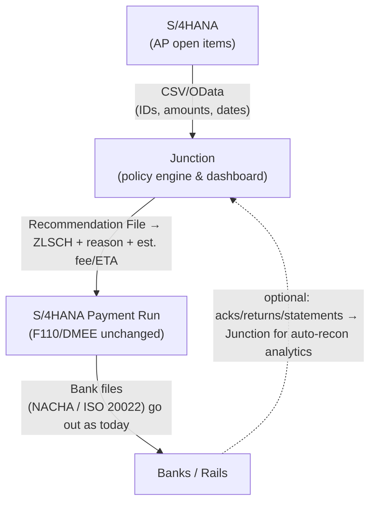

# Junction (Open) — SAP AP Rail Recommendation (SFTP-first)

**Junction** is a lightweight policy engine that recommends the cheapest **safe** payment rail
(**ACH / Same-day ACH / RTP / Wire / Card**) for each AP line item and feeds the result back
into **SAP S/4HANA**. Pilot mode is **decision-only**: you keep your banks & F110 process.

> ⚠️ **Compliance:** Before using with real data, obtain appropriate approvals
> (Outside Business Activity, OSS/IP, data handling). Do **not** upload bank details or PAN.

## Quick start (demo)
```bash
# 1) Clone and enter
git clone <your-repo-url>.git
cd junction-open

# 2) Run the demo on a sample file
python3 demo/demo_runner.py samples/payment_intent_logistics_example.csv out/recommendations_demo.csv

# 3) See the output
head -n 5 out/recommendations_demo.csv
```

**What you’ll see**
- A new CSV with columns: `recommended_rail`, `recommended_payment_method` (ZLSCH), `decision_reason`, `estimated_fee`, `expected_settlement_time`.
- A console summary with **rail mix** and **estimated fees** vs a baseline.

## Repo layout
```
junction-open/
  .github/workflows/lint.yml        # basic CI checks
  LICENSE                           # Apache 2.0
  README.md
  docs/
    runbook_sftp_odata.md           # SAP SFTP & OData integration runbook
    sap_s4hana_mapping_cheatsheet.md
    pilot_loi.md
  policies/
    routing_rules_logistics.yaml    # v0 routing policy (edit per client)
  samples/
    payment_intent_logistics_template.csv
    payment_intent_logistics_example.csv
    payment_intent_logistics_complex_example.csv
    exceptions_queue_template.csv
  schemas/
    payment_intent_v1.schema.json   # column schema for inbound CSV
  tools/
    validate_csv.py                 # quick schema check for inbound CSV
  demo/
    demo_runner.py                  # decision-only CLI
```

## SFTP-first integration (clients)
- SAP exports **open AP items** (IDs only) to SFTP.
- Junction processes and writes back **Recommendations** (ZLSCH) + **Exceptions**.
- SAP mass-updates ZLSCH and runs **F110** as usual.

See **docs/runbook_sftp_odata.md** for filenames, schemas, CPI iFlow, and the OData pattern.

## License
Apache-2.0 (see LICENSE).

## Security
See **SECURITY.md** for how to report vulnerabilities.

